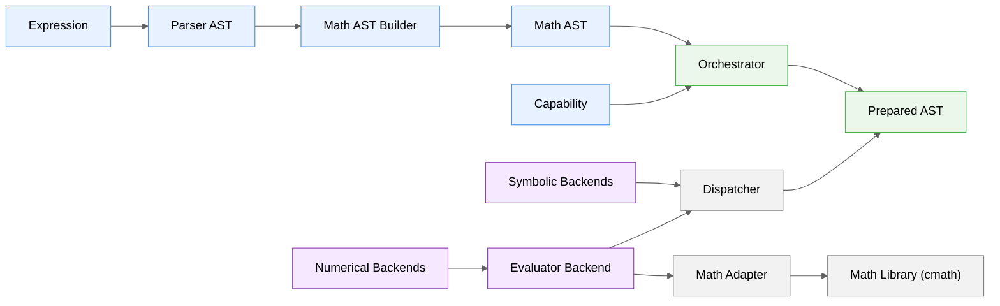

# Architecture

## Introduction

**numathap** is a modern C++ library for symbolic preparation and numerical computation of mathematical expressions. It provides a unified framework capable of parsing expressions, transforming them into an optimized internal representation, and executing specialized numerical algorithms such as expression evaluation, numerical integration, limit computation, and future mathematical backends.

The library is designed around a clear separation of responsibilities. Parsing, symbolic processing, execution dispatching, and numerical algorithms are implemented as independent components that communicate through well-defined interfaces. This modular architecture allows new symbolic transformations and numerical backends to be introduced with minimal impact on existing code.

One of the primary design goals of numathap is to separate **expression preparation** from **expression execution**. Symbolic transformations are performed only once during the preparation stage, producing a reusable representation that can be evaluated multiple times with different execution contexts.

---

## Design Goals

The architecture of numathap is driven by the following principles:

* **Separation of concerns**

  Each component has a single responsibility. Parsing, symbolic processing, execution dispatching, and numerical algorithms remain independent from one another.

* **Backend independence**

  Numerical algorithms are implemented as independent backends. The execution infrastructure does not depend on any specific algorithm.

* **Reusable prepared expressions**

  Expressions are parsed and prepared only once. The resulting prepared representation can be reused efficiently for multiple executions.

* **Configurable preparation pipeline**

  Symbolic transformations are enabled through capabilities configured by the user, allowing expression preparation to be adapted to different use cases.

* **Extensibility**

  New capabilities, numerical algorithms, mathematical libraries, and execution strategies can be added without modifying the existing architecture.

* **Modern C++ design**

  The project follows modern C++ practices with clear ownership semantics, immutable prepared representations whenever possible, and explicit interfaces between components.

---

## High-Level Architecture

The overall processing pipeline is illustrated below.



The architecture is intentionally divided into four major stages:

1. **Frontend**

   Converts the textual mathematical expression into a semantic mathematical representation.

2. **Preparation**

   Applies symbolic transformations and produces a reusable prepared expression.

3. **Execution**

   Traverses the prepared expression and delegates mathematical operations to the selected backend.

4. **Backend**

   Performs the actual numerical computation.

---

## Processing Pipeline

The processing of a mathematical expression consists of two independent phases.

### Preparation Phase

The preparation phase is responsible for converting a textual expression into a reusable internal representation.

```
Expression
    ↓
Parser AST
    ↓
Math AST
    ↓
Orchestrator
    ↓
Prepared AST
```

This phase performs every symbolic transformation requested by the configured environment. Since the resulting tree is reusable, preparation is typically executed only once.

### Execution Phase

The execution phase performs the requested numerical computation.

```
Prepared AST
      ↓
 Dispatcher
      ↓
 Numerical Backend
```

Unlike the preparation phase, execution may occur many times using different execution contexts.

This separation allows expensive symbolic processing to be amortized across multiple evaluations.

> **Design Principle**
>
> Symbolic transformations are performed exclusively during the preparation stage. Numerical backends never modify the prepared expression tree.

---

## Parser AST

The Parser AST is the direct result of syntactic analysis.

Its responsibility is limited to representing the grammatical structure of the input expression. At this stage the tree still reflects the original syntax and is intentionally independent from any mathematical interpretation.

Typical node categories include:

* numeric literals;
* identifiers;
* unary operators;
* binary operators;
* function calls.

The Parser AST is considered an intermediate representation and is not exposed to numerical backends.

---

## Math AST

The Math AST is the semantic representation used throughout the remainder of the library.

It is produced by the **Math AST Builder**, which converts the purely syntactic Parser AST into a mathematical representation suitable for symbolic processing.

Unlike the Parser AST, the Math AST represents mathematical concepts rather than parser grammar.

This separation provides two important advantages:

* parser implementation details remain isolated from the rest of the library;
* symbolic algorithms operate on a representation designed specifically for mathematical transformations.

Every symbolic capability implemented by numathap operates on the Math AST.

---

## Orchestrator

The Orchestrator coordinates the preparation stage.

It receives a Math AST together with a configured `MathEnvironment`, applies every enabled symbolic capability, and produces a `Prepared AST`.

The Orchestrator itself does not implement symbolic algorithms. Instead, it coordinates specialized capabilities that perform individual transformations.

This design keeps the orchestration logic independent from the symbolic algorithms themselves while allowing new capabilities to be introduced without changing the preparation pipeline.

---

## Prepared AST

The Prepared AST is the final result of the preparation phase.

It represents an immutable expression that is ready for execution by any compatible numerical or symbolic backend.

Preparing an expression once and reusing it many times provides several advantages:

* parsing occurs only once;
* symbolic transformations are performed only once;
* multiple execution contexts can reuse the same prepared representation;
* different numerical backends can operate on the same prepared expression.

The Prepared AST forms the boundary between symbolic preparation and numerical execution and is the primary representation consumed by the execution infrastructure.

## MathEnvironment

`MathEnvironment` defines the configuration used during expression preparation and numerical execution.

Rather than representing a single configuration object for the entire library, it acts as a **partial configuration object**. Each backend consumes only the settings that are relevant to its execution, while unspecified options automatically fall back to their default values.

This design allows the configuration interface to evolve without affecting existing APIs.

Current responsibilities include:

* selecting the mathematical library;
* selecting the numeric representation;
* enabling symbolic capabilities.

Future versions may also include backend-specific options such as:

* integration algorithms;
* limit algorithms;
* convergence tolerances;
* optimization strategies;
* execution policies.

The same `MathEnvironment` instance can be reused for preparing multiple expressions.

---

## The `configure()` Function

The recommended way to construct a `MathEnvironment` is through the public `configure()` function.

Instead of requiring users to manually populate configuration objects, `configure()` provides a concise and expressive API for enabling capabilities and selecting execution options.

Example:

```cpp
auto env = configure(Capability::Simplifier);

auto ast = prepare("x * 1 + 0", env);
```

When no environment is explicitly provided, library functions use the default configuration.

For example:

```cpp
auto ast = prepare("sin(x)");
```

is equivalent to using a default-configured `MathEnvironment`.

The configuration model intentionally supports incremental growth. As new backends and algorithms are introduced, additional options can be incorporated into `configure()` without changing the existing architecture.

> **Design Principle**
>
> Library users configure behavior through `configure()`. Components consume only the options relevant to their responsibilities while all unspecified settings assume their default values.

---

## Capabilities

A **Capability** represents an optional symbolic transformation applied during the preparation stage.

Capabilities are executed by the Orchestrator before the `Prepared AST` is produced.

Each capability is independent and focuses on a specific symbolic task.

Examples of future capabilities include:

* symbolic simplification;
* symbolic differentiation;
* common subexpression elimination;
* algebraic normalization;
* symbolic expansion;
* symbolic factorization.

Because capabilities are independent, they can be enabled or disabled individually without affecting the overall architecture.

---

## Simplifier

The first implemented capability is the **Simplifier**.

Its responsibility is to perform algebraic simplifications that preserve the mathematical meaning of the expression while reducing its complexity.

Typical transformations include:

```text
x * 1    → x
1 * x    → x
x + 0    → x
0 + x    → x
x - 0    → x
0 * x    → 0
x / 1    → x
```

The Simplifier operates exclusively on the Math AST during the preparation stage.

Once preparation has completed, numerical backends execute the resulting `Prepared AST` without performing additional symbolic modifications.

Future versions may extend the Simplifier with more advanced symbolic transformations while preserving its independent role within the capability framework.

---

## Dispatcher

The Dispatcher is responsible for executing a prepared expression.

It traverses the `Prepared AST` and delegates mathematical operations to the selected backend.

The Dispatcher intentionally contains no numerical algorithms and performs no symbolic transformations.

Its responsibilities are limited to:

* traversing the prepared tree;
* coordinating backend execution;
* forwarding mathematical operations;
* maintaining backend independence.

Because traversal is centralized, multiple numerical backends can reuse the same execution infrastructure.

---

## Numerical Backends

A backend implements a specific numerical algorithm.

Each backend operates on a `Prepared AST` and produces a result appropriate for its domain.

Examples include:

* numerical evaluation;
* numerical integration.

Future backends may include:

* limit computation;
* root finding;
* equation solving;
* optimization;
* differential equation solvers;
* interpolation.

Backends remain independent from one another and share only the common execution infrastructure.

---

## Evaluator Backend

The Evaluator backend computes the numerical value of a prepared expression.

During execution it resolves:

* variables stored in a `Context`;
* mathematical constants provided by the selected mathematical library;
* function calls supported by the configured mathematical adapter.

The Evaluator does not modify the prepared expression.

Instead, it receives a `Prepared AST` from the Dispatcher and computes its numerical result using the execution context supplied by the caller.

A prepared expression can therefore be evaluated repeatedly with different variable assignments without requiring a new preparation step.

---

## Context

`Context` stores the values associated with variables used during numerical execution.

The Context intentionally remains backend-independent.

It acts only as a container of user-provided values and does not perform symbolic processing or mathematical interpretation.

This separation keeps execution contexts simple while allowing different numerical backends to interpret the stored information according to their own requirements.

---

## Math Adapter

The Math Adapter abstracts the mathematical library used during execution.

Its responsibilities include:

* evaluating mathematical functions;
* providing mathematical constants;
* isolating backend code from any specific mathematical implementation.

The default implementation uses the C++ standard mathematical library (`cmath`).

Alternative adapters can be implemented without modifying the parser, symbolic capabilities, dispatcher, or numerical backends.

This abstraction allows the execution infrastructure to remain independent from any particular mathematical library while supporting future extensions.

## Public API

The public API is intentionally designed to provide a simple and expressive interface while hiding the internal processing pipeline.

A typical workflow consists of three steps:

1. Configure the execution environment (optional).
2. Prepare the mathematical expression.
3. Execute the prepared expression using the desired backend.

Example:

```cpp
using namespace numathap;

auto env = configure(Capability::Simplifier);

auto ast = prepare("sin(x) + x * 1", env);

Context ctx;
ctx.setValue("x", "pi / 2");

Value result = evaluate(ast, ctx);
```

When no explicit configuration is provided, the library automatically uses the default `MathEnvironment`.

---

## Python Bindings

numathap provides Python bindings implemented using **pybind11**.

The Python interface follows the same architectural principles as the C++ API, exposing the same preparation and execution workflow.

Example:

```python
import numathap

ast = numathap.prepare("sin(x)")

ctx = numathap.Context()
ctx.setValue("x", "pi / 2")

result = numathap.evaluate(ast, ctx)

print(result)
```

The Python bindings are implemented as a thin layer over the C++ library. All parsing, symbolic processing, dispatching, and numerical computation are performed by the native implementation.

This approach guarantees consistent behavior between the C++ and Python APIs while minimizing maintenance effort.

---

## Directory Organization

The project is organized according to functional responsibilities.

```text
include/
    numathap/
        backend/
        config/
        core/
        dispatch/
        math/
        numeric/
        orchestration/
        parser/
        symbolic/

src/
    backend/
    config/
    core/
    dispatch/
    math/
    numeric/
    orchestration/
    parser/
    symbolic/

python/
    bindings/
    numathap/
    tests/

tests/
```

Each module contains components with a single, well-defined responsibility.

This organization keeps related functionality together while reducing coupling between independent parts of the library.

---

## Extending numathap

The architecture is designed to accommodate future extensions without requiring structural modifications.

### Adding a Capability

A new capability should:

1. Operate exclusively on the Math AST.
2. Preserve the mathematical meaning of the expression.
3. Be independent from other capabilities whenever possible.
4. Be invoked only by the Orchestrator.
5. Produce a transformed Math AST that becomes part of the preparation pipeline.

Capabilities must never perform numerical computation.

---

### Adding a Backend

A new numerical backend should:

1. Consume a `Prepared AST`.
2. Reuse the Dispatcher for tree traversal.
3. Implement only its own numerical algorithm.
4. Avoid symbolic transformations during execution.
5. Use only the configuration relevant to its execution.

Backends remain independent from one another and may evolve without affecting the rest of the architecture.

---

## Design Principles

The architecture of numathap is guided by the following principles.

### Separation of Preparation and Execution

Preparation is responsible for symbolic processing.

Execution is responsible for numerical computation.

These two stages are intentionally isolated.

---

### Single Responsibility

Each major component has one primary responsibility.

Examples include:

* the Parser performs syntactic analysis;
* the Math AST Builder performs semantic conversion;
* the Orchestrator coordinates symbolic preparation;
* Capabilities perform symbolic transformations;
* the Dispatcher coordinates execution;
* Backends perform numerical algorithms.

---

### Backend Independence

The execution infrastructure does not depend on any specific numerical algorithm.

All numerical algorithms operate through the same execution pipeline.

---

### Configuration Independence

Configuration is centralized in `MathEnvironment`.

Each component consumes only the configuration parameters that are relevant to its responsibilities.

---

### Extensibility

The architecture is designed so that new symbolic capabilities, numerical backends, mathematical libraries, and execution options can be introduced without modifying the existing processing pipeline.

This minimizes coupling and promotes long-term maintainability.

---

## Future Evolution

The current architecture has been designed to support continued growth while preserving backward compatibility whenever possible.

Planned areas of expansion include:

* additional symbolic capabilities;
* multiple numerical integration algorithms;
* multiple limit algorithms;
* root-finding algorithms;
* optimization algorithms;
* additional mathematical library adapters;
* support for additional numeric representations;
* expanded Python interface;
* additional execution backends.

The core processing pipeline—

```text
Expression
    ↓
Parser AST
    ↓
Math AST
    ↓
Orchestrator
    ↓
Prepared AST
    ↓
Dispatcher
    ↓
Backend
```

—is expected to remain stable as new functionality is added.

Maintaining a clear separation between symbolic preparation and numerical execution ensures that the architecture can evolve incrementally without requiring fundamental changes to the overall design.
