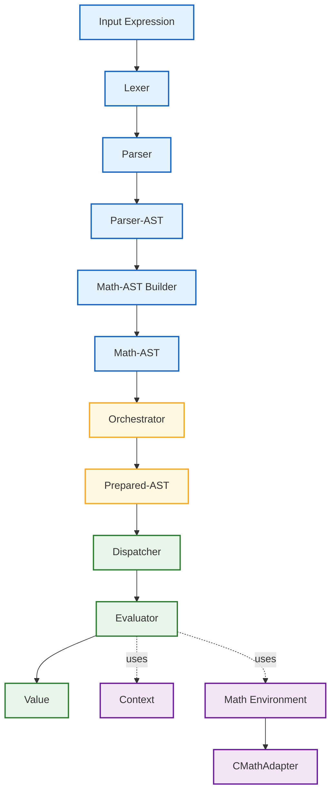

# Numathap Architecture

## Overview

**numathap** is a modern C++ library for mathematical expression processing and numerical computation.

Its primary goal is to allow mathematical expressions to be represented as strings, transformed into an internal mathematical representation, prepared for execution, and evaluated through interchangeable execution backends.

The current implementation provides a complete numerical evaluation pipeline based on:

- the C++ Standard Library (`<cmath>`);
- the `double` floating-point type;
- the `Evaluator` backend.

Although the current implementation focuses on numerical evaluation, the architecture was intentionally designed to support future mathematical services such as symbolic simplification, differentiation, numerical integration, limit computation, optimization, and additional execution backends without requiring changes to the core processing pipeline.

The architecture follows classical compiler principles while separating expression parsing from mathematical representation and execution.

This separation makes the internal representation independent of both the parser implementation and the mathematical library used during execution.

---

# Current Status

The current implementation includes:

- lexical analysis;
- syntactic analysis;
- Parser-AST generation;
- Math-AST generation;
- expression preparation;
- Prepared-AST generation;
- execution through the Dispatcher;
- numerical evaluation through the Evaluator backend;
- runtime variable resolution using Context;
- mathematical function and constant resolution through CMathAdapter;
- numerical values represented by `Value`;
- execution based on the C++ Standard Library (`<cmath>`);
- execution using the `double` numeric type.

The architecture already defines the extension points required to support additional mathematical libraries, numeric types and execution backends in future releases.

---

# Public API

The public API provides a simple workflow composed of two distinct phases:

1. expression preparation;
2. numerical evaluation.

Expressions are parsed and prepared only once.

The resulting Prepared-AST may then be evaluated multiple times using different execution contexts.

Typical usage is:

```cpp
numathap::Context ctx;

auto prep = numathap::prepare("sin(x) + sqrt(y)");

ctx.setValue("x", "pi/2");
ctx.setValue("y", "25");

auto result = numathap::evaluate(prep, ctx);
```

Separating preparation from evaluation avoids repeated parsing and allows efficient reuse of compiled mathematical expressions.

---

# Expression Processing

## Token

A **Token** represents a lexical element of the mathematical language.

Examples include:

- numeric literals;
- identifiers;
- operators;
- delimiters;
- reserved symbols.

Tokens contain no syntactic or mathematical information.

---

## Lexer

The **Lexer** converts an input character stream into an ordered sequence of tokens.

Example:

```text
sin(x) + 2*x
```

becomes

```text
FUNCTION(sin)
LPAREN
IDENTIFIER(x)
RPAREN
PLUS
NUMBER(2)
MULTIPLY
IDENTIFIER(x)
```

The Lexer performs no grammar validation.

Its sole responsibility is lexical analysis.

---

## Parser

The **Parser** validates the expression grammar and constructs the Parser-AST.

Parser nodes represent only syntactic constructs.

Examples include:

- numeric literals;
- identifiers;
- unary operators;
- binary operators;
- function calls;
- parenthesized expressions.

The Parser contains no mathematical semantics.

Example:

```text
sin(x) + x²
```

produces the syntactic tree

```text
        +
       / \
    sin   ^
     |   / \
     x  x   2
```

---

# Parser-AST

The Parser-AST represents the grammatical structure of an expression.

Its purpose is to preserve the syntax recognized by the Parser.

Parser-AST nodes contain no mathematical behavior and are independent of the execution engine.

The Parser-AST exists only as an intermediate representation between parsing and mathematical interpretation.

---

# Math-AST Builder

The **Math-AST Builder** converts the Parser-AST into a Math-AST.

While the Parser-AST represents syntax, the Math-AST represents mathematical meaning.

Equivalent syntactic constructs may therefore produce equivalent mathematical representations.

This separation allows the mathematical representation to remain independent of parser implementation details and enables future frontends to generate the same Math-AST.

---

# Mathematical Representation

## Math-AST

The Math-AST is the central mathematical representation used by numathap.

Unlike the Parser-AST, it models mathematical concepts instead of grammar rules.

Execution backends never operate directly on the Parser-AST.

Instead, all execution components receive the Math-AST (or a Prepared-AST derived from it), allowing multiple algorithms to share the same mathematical representation.

The Math-AST contains no execution logic.

Its responsibility is solely to represent mathematical expressions in a form suitable for further processing.

---

# Configuration System

## Configurator

The **Configurator** is responsible for creating and configuring the execution environment.

Its responsibilities include:

- selecting the mathematical library;
- selecting the numeric type;
- enabling execution capabilities;
- defining execution options.

The Configurator performs no mathematical computation.

Instead, it assembles a consistent execution environment that will later be used by the execution pipeline.

---

# Execution Environment

## Math Environment

The **Math Environment** represents the complete runtime environment used during expression execution.

It contains all execution-related resources required by the runtime components.

The current implementation includes:

- a Math Adapter;
- the selected numeric type;
- the enabled capability set;
- execution options.

Execution components receive a Math Environment rather than accessing configuration objects directly.

The Math Environment itself performs no mathematical computation.

Its purpose is to provide all runtime services required by the execution pipeline.

---

## Math Adapter

The **Math Adapter** isolates the execution engine from any specific mathematical library.

Its responsibilities include:

- resolving mathematical functions;
- resolving mathematical constants;
- adapting library-specific behavior;
- exposing a uniform interface to execution backends.

The Evaluator communicates exclusively with the Math Adapter.

Consequently, the Evaluator contains no knowledge of any particular mathematical library.

Replacing the mathematical library requires only a different Math Adapter implementation.

---

## Current Mathematical Library

The current implementation provides a single Math Adapter:

- **CMathAdapter**

The CMathAdapter encapsulates the C++ Standard Library (`<cmath>`).

It provides access to the mathematical functions and constants supported by that library while exposing a uniform interface to the execution engine.

All mathematical function calls performed by the Evaluator are delegated to the CMathAdapter.

---

# Preparation Phase

## Orchestrator

The **Orchestrator** prepares a Math-AST before execution.

The result of this preparation is a **Prepared-AST**, which can be evaluated repeatedly without rebuilding the mathematical representation.

In the current implementation, the preparation phase focuses on producing the representation required by the numerical evaluation backend.

The Orchestrator performs no numerical computation.

Its responsibility is limited to preparing the mathematical representation for execution.

---

## Prepared-AST

The Prepared-AST represents a Math-AST after the preparation phase has been completed.

Prepared expressions are immutable and may be evaluated multiple times using different execution contexts.

This separation between preparation and execution avoids repeated parsing and repeated construction of internal mathematical structures.

Prepared-AST instances are shared by all execution backends.

---

# Shared Runtime Infrastructure

## Dispatcher

The **Dispatcher** traverses the Prepared-AST and delegates execution to the selected backend.

The Dispatcher itself contains no mathematical algorithms.

Its responsibility is limited to navigating the prepared mathematical representation and forwarding execution requests.

The current implementation dispatches execution exclusively to the Evaluator backend.

The architecture allows additional execution backends to be introduced without modifying either the AST hierarchy or the Dispatcher itself.

---

## Context

The **Context** stores runtime information associated with a numerical evaluation.

The current implementation supports:

- variable values;
- constant expressions represented as strings.

For example:

```cpp
ctx.setValue("x", "pi/2");
ctx.setValue("y", "sqrt(2)");
```

When evaluating an expression, the Evaluator first attempts to interpret Context entries as numeric values.

If direct numeric conversion fails, the value is treated as a constant expression and evaluated using the same numerical infrastructure employed for ordinary expressions.

Constant expressions are restricted to expressions that do not depend on variables.

This mechanism allows mathematical constants such as `"pi/2"` or `"sqrt(2)"` to be stored directly in the Context while keeping the Context independent of any particular mathematical library.

---

## Value

The **Value** type represents numerical values manipulated by execution backends.

The current implementation stores values using the `double` floating-point type.

All numerical results produced by the Evaluator are represented by Value objects.

Although the current implementation is based on `double`, the Value abstraction was intentionally designed to allow future support for additional numeric representations without requiring changes to the public execution pipeline.

---

# Current Execution Backend

## Evaluator

The **Evaluator** is the first execution backend implemented by numathap.

Its responsibility is to numerically evaluate a Prepared-AST using the information stored in the Context and the services provided by the Math Environment.

The Evaluator operates as a stateless execution component.

For each evaluation it receives:

- a Prepared-AST;
- a Context;
- a Math Environment.

Using these objects, it computes and returns a Value representing the numerical result of the expression.

The Evaluator performs:

- arithmetic operations;
- variable resolution;
- constant resolution;
- function evaluation;
- recursive evaluation of mathematical expressions.

Whenever a mathematical function or constant must be resolved, the Evaluator delegates the operation to the Math Adapter contained in the Math Environment.

As a consequence, the Evaluator remains completely independent of the mathematical library being used.

---

## Constant Expression Evaluation

The current implementation allows Context entries to contain either:

- numeric values;
- constant mathematical expressions represented as strings.

Examples include:

```cpp
ctx.setValue("x", "3.5");
ctx.setValue("y", "pi/2");
ctx.setValue("z", "sqrt(2)");
```

When a Context entry cannot be interpreted directly as a numeric value, the Evaluator performs a controlled preparation and evaluation step to obtain its numerical value.

Only expressions composed of constants and mathematical functions are accepted.

Expressions containing variables are rejected during evaluation.

This design keeps the Context independent of parser or backend implementations while allowing convenient use of mathematical constants.

---

# Current Processing Pipeline

The current execution pipeline is illustrated below.



During evaluation, the Evaluator accesses:

- Context;
- Math Environment;
- CMathAdapter.

The processing pipeline intentionally separates parsing, mathematical representation, preparation and execution.

This separation allows future execution backends to reuse the same Prepared-AST without requiring modifications to the front-end components.

---

# Extension Points

The current implementation intentionally defines several architectural extension points.

These extension points are part of the architecture even though corresponding implementations may not yet exist.

---

## Additional Mathematical Libraries

The execution engine communicates exclusively through the Math Adapter interface.

Future implementations may therefore introduce additional mathematical libraries simply by providing new Math Adapter implementations.

Possible future adapters include:

- Boost.Math;
- arbitrary-precision libraries;
- scientific libraries;
- user-defined mathematical libraries.

No changes to the parser, mathematical representation or execution pipeline are required.

---

## Additional Numeric Types

The current implementation evaluates expressions using `double`.

Future versions may support additional numeric representations such as:

- `long double`;
- arbitrary precision floating-point types;
- fixed-precision decimal types;
- complex numbers;
- custom numeric types.

The Value abstraction isolates execution backends from the underlying numeric representation.

---

## Additional Execution Backends

The Dispatcher architecture allows new execution backends to reuse the same Prepared-AST.

Examples include:

- symbolic simplification;
- symbolic differentiation;
- numerical integration;
- limit computation;
- optimization algorithms;
- root-finding algorithms;
- future mathematical services.

These backends can be introduced without modifying the parser or the mathematical representation.

---

## Orchestrator Extensions

The preparation phase may be expanded as additional execution backends become available.

Possible future preparation stages include:

- normalization;
- constant folding;
- algebraic simplification;
- structural optimization;
- elimination of redundant expressions;
- backend-specific preprocessing.

Each execution backend may benefit from different preparation strategies while continuing to share the same mathematical representation.

---

# Planned Implementations

The following components are part of the long-term architecture but are **not** included in the current implementation.

They represent the intended evolution of the library while preserving the execution pipeline described in this document.

---

## Simplifier

The Simplifier will operate directly on the Prepared-AST.

Its purpose will be to transform mathematical expressions into equivalent but simpler forms.

Typical simplifications may include:

- constant folding;
- algebraic identities;
- elimination of redundant operations;
- canonicalization of mathematical expressions.

The Simplifier will produce another mathematical representation that can be evaluated by the existing execution infrastructure.

---

## Integrator

The Integrator will provide numerical integration algorithms operating on Prepared-AST instances.

Rather than evaluating expressions directly, it will repeatedly invoke the Evaluator at different points according to the selected numerical integration algorithm.

Possible algorithms include adaptive quadrature and Gaussian integration methods.

---

## Limit Calculator

The Limit Calculator will compute numerical limits using repeated evaluations performed by the Evaluator.

Different numerical strategies may be implemented depending on the characteristics of the expression and the desired accuracy.

---

## Symbolic Differentiator

The Symbolic Differentiator will transform a mathematical expression into another mathematical representation corresponding to its symbolic derivative.

The resulting representation may then be simplified or evaluated using the existing execution pipeline.

---

## Python Bindings

The architecture was designed to expose the public API to Python through **pybind11**.

Python bindings will provide access to the same preparation and evaluation workflow available in the C++ API while preserving the underlying architecture.

---

# Architecture Summary

The current implementation is composed of the following major components.

## Front-End

- Token
- Lexer
- Parser
- Parser-AST
- Math-AST Builder
- Math-AST

---

## Configuration

- Configurator
- Math Environment
- CMathAdapter

---

## Preparation

- Orchestrator
- Prepared-AST

---

## Runtime Infrastructure

- Dispatcher
- Context
- Value

---

## Execution

- Evaluator

---

## Future Extensions

The architecture already defines extension points for:

- additional Math Adapters;
- additional mathematical libraries;
- additional numeric types;
- additional execution backends;
- symbolic processing;
- numerical algorithms;
- Python bindings.

---

# Design Principles

The architecture of numathap is based on the separation of responsibilities between independent components.

The processing pipeline separates:

- lexical analysis;
- syntactic analysis;
- mathematical representation;
- execution environment;
- preparation;
- execution.

Parser components are responsible only for recognizing the mathematical language.

The Math-AST provides a mathematical representation independent of parser implementation details.

The Orchestrator prepares mathematical expressions for execution without embedding execution logic into the representation itself.

Execution is delegated by the Dispatcher to specialized backends.

The Evaluator performs numerical computation while remaining independent of the mathematical library through the Math Adapter abstraction.

This separation allows new mathematical libraries, numeric types, optimization stages and execution backends to be introduced with minimal impact on the existing architecture.

The current implementation establishes the foundation of this architecture through numerical evaluation based on the C++ Standard Library (`<cmath>`), the `double` numeric type and the Evaluator backend.

Future implementations will extend these capabilities while preserving the same architectural principles and execution pipeline.